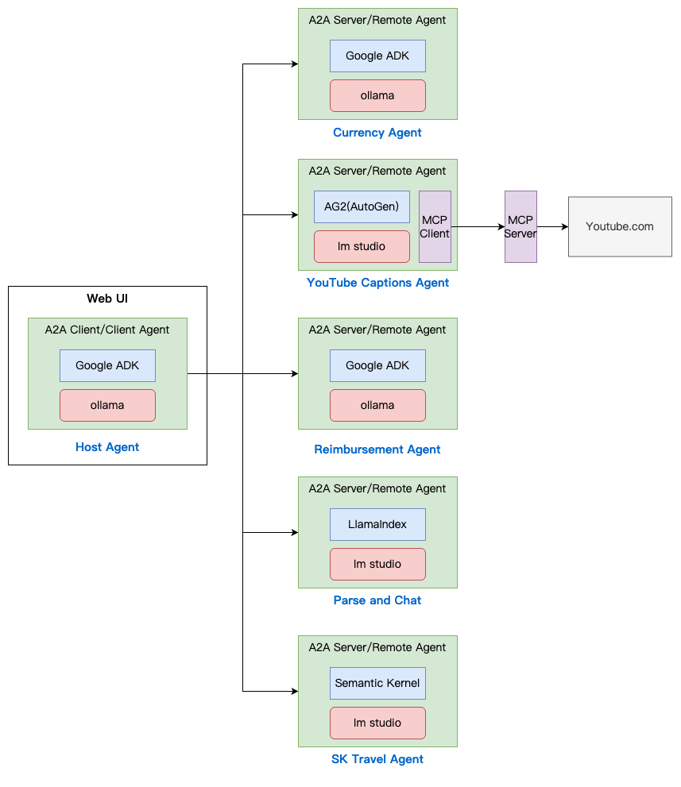

# Agent2Agent (A2A) Protocol Side

Fork from <https://github.com/google/A2A> and change to use local llm.



## A2A Server (Remote Agent)

### 1 ag2

```sh
cd samples/python/
uv run agents/ag2
```

`localhost:10010`

```
Agent Name: YouTube Captions Agent
Agent Description: AI agent that can extract closed captions and transcripts from YouTube videos. This agent provides raw transcription data that can be used for further processing.
Input Modes: text, text/plain
Output Modes: text, text/plain
Streaming Supported: True
Push Notifications Supported: None
```

#### mcp server

https://github.com/sparfenyuk/mcp-youtube

```bash
uv tool install git+https://github.com/sparfenyuk/mcp-youtube

find ~/.local/share/uv -name mcp-youtube -type f 2>/dev/null
```

#### test case

```text
Summarize this video: https://www.youtube.com/watch?v=kQmXtrmQ5Zg (Building Agents with Model Context Protocol - Full Workshop with Mahesh Murag of Anthropic)
```

### 2 google_adk

```sh
cd samples/python/
uv run agents/google_adk
```

`localhost:10002`

```
Agent Name: Reimbursement Agent
Agent Description: This agent handles the reimbursement process for the employees given the amount and purpose of the reimbursement.
Input Modes: text, text/plain
Output Modes: text, text/plain
Streaming Supported: True
Push Notifications Supported: None
```

### 3 langgraph

```sh
cd samples/python/
uv run agents/langgraph
```

`localhost:10000`

```
Agent Name: Currency Agent
Agent Description: Helps with exchange rates for currencies
Input Modes: text, text/plain
Output Modes: text, text/plain
Streaming Supported: True
Push Notifications Supported: True
```

#### Agent Card

```sh
http http://localhost:10000/.well-known/agent.json
```

```json
{
  "capabilities": {
    "pushNotifications": true,
    "streaming": true
  },
  "defaultInputModes": ["text", "text/plain"],
  "defaultOutputModes": ["text", "text/plain"],
  "description": "Helps with exchange rates for currencies",
  "name": "Currency Agent",
  "skills": [
    {
      "description": "Helps with exchange values between various currencies",
      "examples": ["What is exchange rate between USD and GBP?"],
      "id": "convert_currency",
      "name": "Currency Exchange Rates Tool",
      "tags": ["currency conversion", "currency exchange"]
    }
  ],
  "url": "http://localhost:10000/",
  "version": "1.0.0"
}
```

### 4 semantickernel

```sh
cd samples/python/
uv run agents/semantickernel
```

`localhost:10020`

```
Agent Name: SK Travel Agent
Agent Description: Semantic Kernel-based travel agent providing comprehensive trip planning services including currency exchange and personalized activity planning.
Input Modes: text
Output Modes: text
Streaming Supported: True
Push Notifications Supported: False
```

### 5

```sh
uv run agents/llama_index_file_chat
```

```
Agent Name: Parse and Chat
Agent Description: Parses a file and then chats with a user using the parsed content as context.
Input Modes: text/plain, application/pdf, application/msword, image/png, image/jpeg
Output Modes: text, text/plain
Streaming Supported: True
Push Notifications Supported: True
```

## A2A Client (Client Agent)

### CLI

```sh
cd samples/python/
export agent_port=10010
uv run hosts/cli --agent http://localhost:$agent_port
```

### Web UI with ollama

`samples/python/hosts/multiagent/host_agent.py`

```sh
cd ~/coding/a2a-side/demo/ui
uv run main.py
```

<http://127.0.0.1:12000/>
